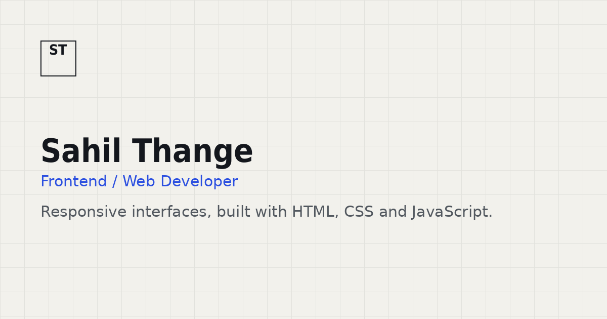

# ✦ SAHIL THANGE

<p align="center">
  
</p>

<p align="center">
  <strong>WEB DEVELOPER · UI/UX ENTHUSIAST · AI PRODUCT BUILDER</strong>
</p>

<p align="center">
  Building modern digital experiences where
  <strong>design, development and technology</strong> come together.
</p>

<br>

<p align="center">
  <a href="https://sahil-thange-portfolio.vercel.app/">
    
  </a>
  &nbsp;
  <a href="https://github.com/SahilRT07">
    
  </a>
  &nbsp;
  <a href="https://www.linkedin.com/in/sahil-thange-789b5434b/">
    
  </a>
</p>

<p align="center">
  
  
  
  
</p>

---

# 👋 ABOUT

<table>
<tr>
<td width="65%" valign="top">

I'm **Sahil Thange**, an IT engineering student and web developer focused on creating modern, responsive and user-centered digital products.

I enjoy taking ideas from an initial concept and turning them into interfaces and applications that people can actually use.

My projects cover different areas of development — from frontend fundamentals and responsive interfaces to management systems, data-driven applications, backend APIs and AI-powered product experiences.

I'm especially interested in the intersection of:

**Development × Design × AI × Product Thinking**

</td>

<td width="35%" valign="top">

### CURRENT DIRECTION

```text
Frontend
   ↓
React
   ↓
Full-Stack
   ↓
AI Applications
   ↓
Product Engineering
